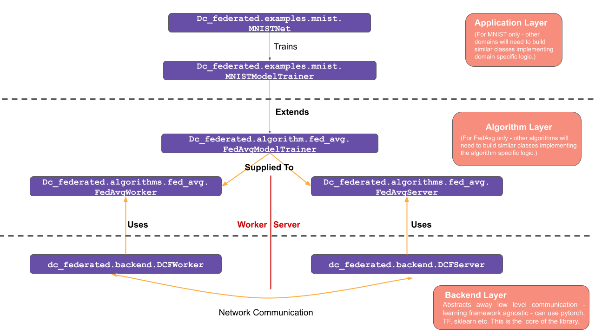

## The Core Principle: 

The core principles behind the design of the `dc_federated` library are the classic software engineering ideas of layering, modularity and separation of concerns. One important decision that was made was to make the library independent of any specific machine learning or deep learning platform. This ensures that the library has wide applicability and can also be used with any future platforms that are developed or come into prominence. Given the above, the library architecture has been divided into three layers.

- **Backend Layer:** The Backend Layer provides a platform independent API which enables worker nodes and the central server to exchange messages regarding worker/server status and model updates. This is the core of the library and independent of the other two layers.  

- **Algorithm Layer:** Specific federated learning algorithms are implemented in the Algorithm Layer, which uses the he API of the Backend Layer to implement the communication protocol necessary for specific algorithm. The main repo comes with an example algorithm, [FedAvg](../examples/using_fed_avg.md), implemented. Implementers of other algorithms will need add their own modules at this layer. The FedAvg implementation can serve as a reference for these new implementations.

- **Application Layer:** Finally, specific domains or applications are implemented at the application layer which uses the API provided by the algorithm Layer to implement domain/application specific training and testing logic. The library comes with two reference implementations for the [MNIST dataset](../examples/mnist.md) and [PlantVillage dataset](../examples/plantvillage.md), both using  using the FedAvg algorithm. 

The figure below illustrates how these layers maps into different classes in the library for the specific case of the FedAvg algorithm. 

Please see the code in `src/algorithms/fed_avg` to see how the library may be used to implement specific federated learning algorithms (in this case `FedAvg`), and see `src/examples/mnist` to see how to apply the algorithm for specific datasets.

